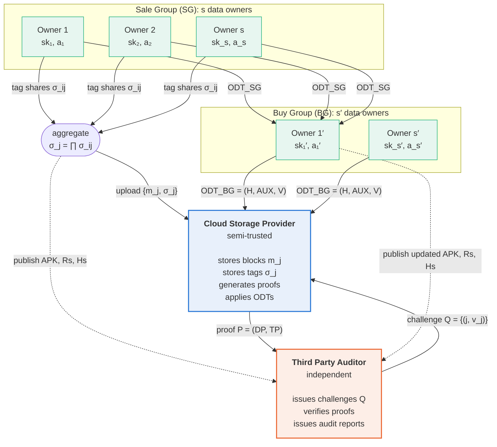
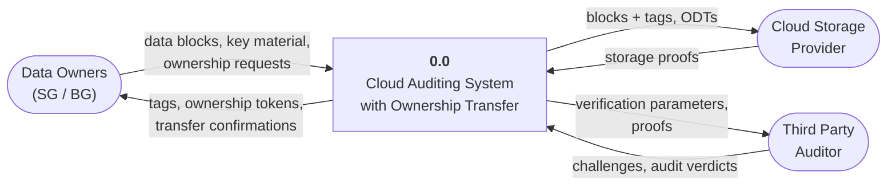
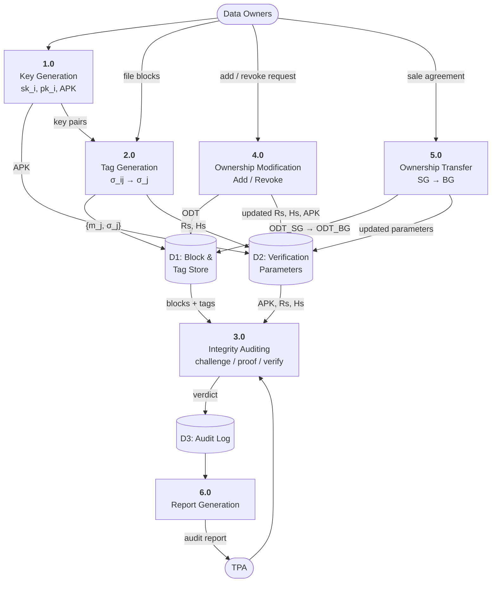
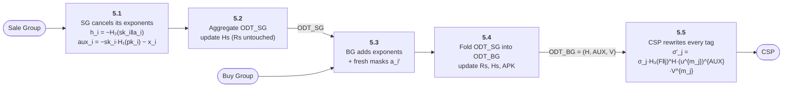
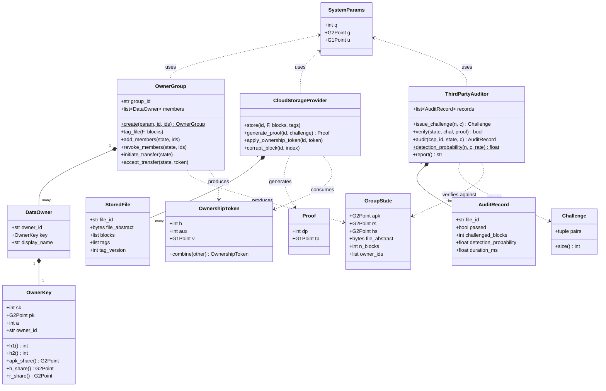
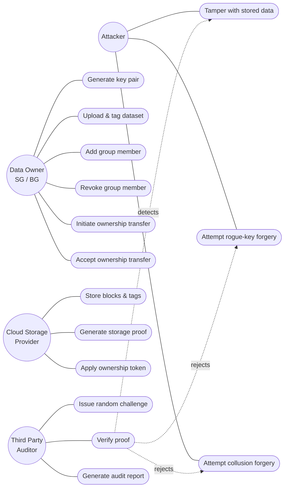
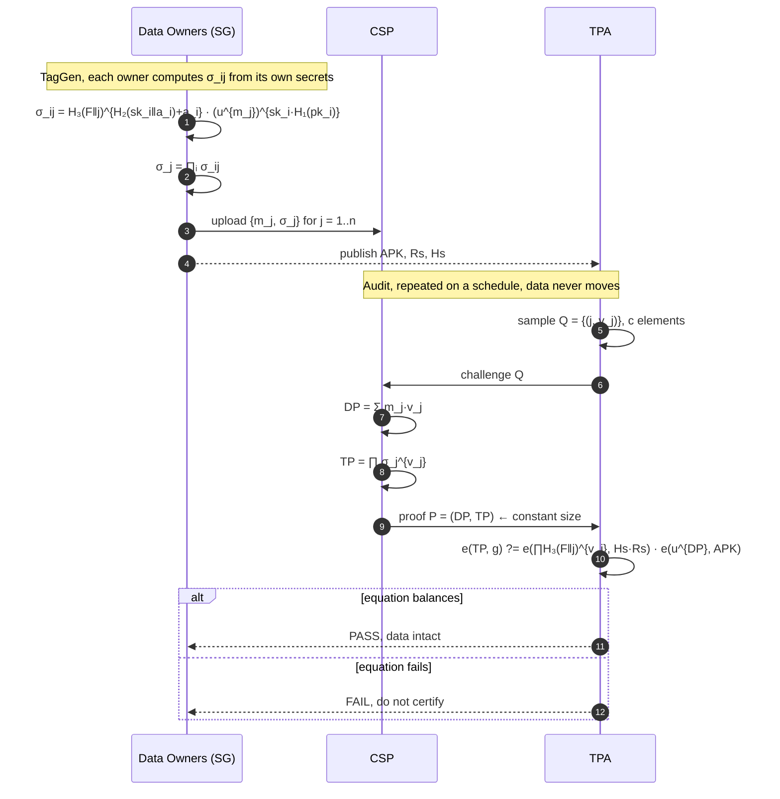
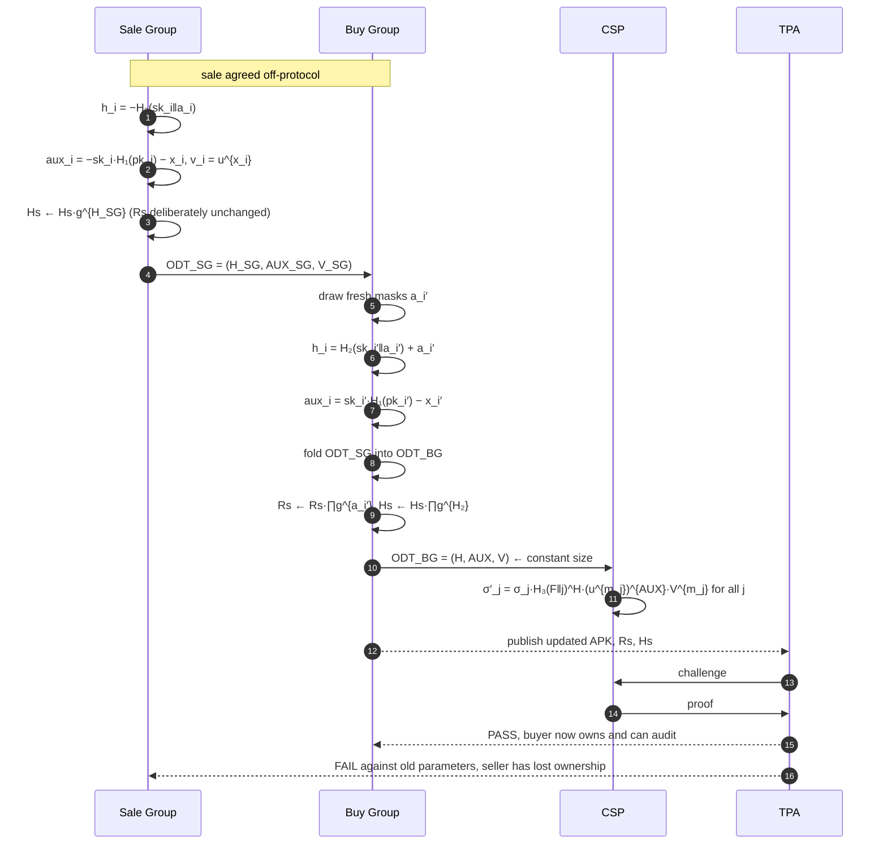
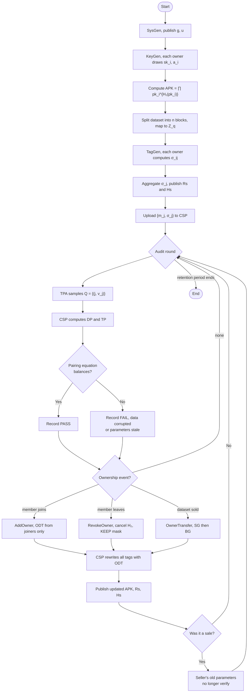

# Chapter 4: System Design Diagrams

All diagrams are written in **Mermaid**, and every one is already rendered as a high-resolution PNG in `images/` (one file per figure, named after its figure number), ready to place in the bound report. The individual Mermaid sources are in `src/`.

To re-render after editing a diagram:

```bash
npx -y @mermaid-js/mermaid-cli -i src/<name>.mmd -o images/<name>.png -b white -s 3
```

(or paste a code block into <https://mermaid.live> and export manually.)

Keeping the diagrams as text (rather than only as images) means they stay editable and stay in step with the code as it changes.

---

## Figure 4.1.1: System Architecture

The four entities of the paper's system model, and what actually crosses each boundary. Note that no secret material ever reaches the CSP or the TPA.



**Key point for the viva:** the only things the TPA ever sees are `APK`, `Rs`, `Hs`, the challenge it chose itself, and a constant-size proof. It cannot reconstruct any block, which is why this is *privacy-preserving* public auditing.

---

## Figure 4.2.1: Data Flow Diagram (Level 0 / Context)



---

## Figure 4.2.2: Data Flow Diagram (Level 1)



### Level 2: expansion of process 5.0 (Ownership Transfer)



> **Why Rs is not updated in 5.2**: the sale group's random masks `a_i` stay embedded in every tag permanently. This is the mechanism that defeats the collusion attack: even a buyer who learns the index secret cannot forge tags, because the seller's masks remain and cannot be removed.

---

## Figure 4.3.1: Class Diagram

Mirrors the actual module structure in `code/`.



---

## Figure 4.3.2: Use Case Diagram



---

## Figure 4.3.3(a): Sequence Diagram: Integrity Auditing



## Figure 4.3.3(b): Sequence Diagram: Ownership Transfer



---

## Figure 4.3.3(c): Activity Diagram: Complete Dataset Lifecycle



---

## Notes for the report

- Figures 4.1.1, 4.2.1, 4.2.2 replace the corresponding placeholders in the drafted report.
- Figure 4.3.3 in the drafted report is listed as "Activity and Sequence Diagram"; it is split here into three sub-figures (a), (b), (c) because one diagram cannot legibly carry both the audit protocol and the transfer protocol.
- Every diagram was drawn from the implemented code in `code/`, not from the paper alone, so the class names and method signatures match what an examiner will find if they open the source.
